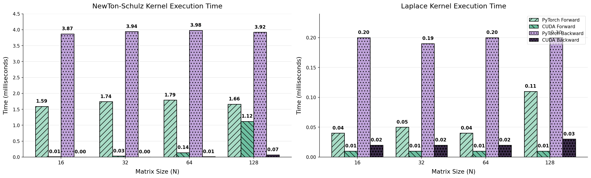

# [ICLR2026] LaplacianFormer: Rethinking Linear Attention with Laplacian Kernel

Implementation of "LaplacianFormer: Rethinking Linear Attention with Laplacian Kernel" (https://arxiv.org/pdf/2604.20368).

This repository provides the **CUDA source code** of the custom PyTorch operators introduced in the paper, including the Laplacian Subtraction kernel and the Newton Inverse kernel. These operators are the core building blocks of the Laplacian-kernel-based linear attention proposed in the paper.


## Benchmark



The figure above shows the optimization effect of the provided CUDA operators.

> 🙈**Note:** The kernels in this repository are specifically tuned for the **NVIDIA A100 (sm_80)** GPU. 

## Citation

```
@inproceedings{zhe2026rethinking,
      title={LaplacianFormer: Rethinking Linear Attention with Laplacian Kernel},
      author={Zhe Feng and Sen Lian and Changwei Wang and Muyang Zhang and Tianlong Tan and Rongtao Xu and Weiliang Meng and Xiaopeng Zhang},
      year={2026},
      booktitle={ICLR},
}
```
